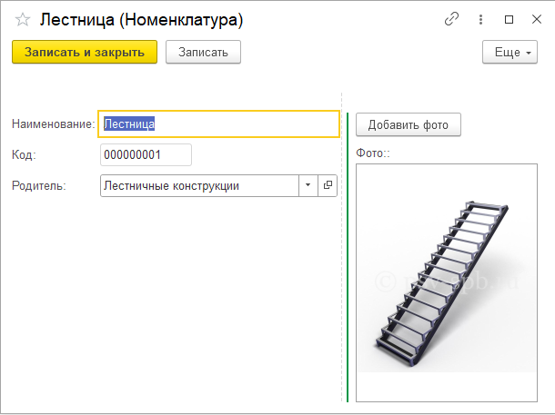
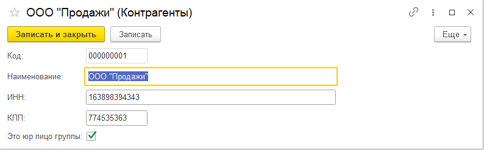

# 👨‍💻 Портфолио начинающего специалиста 1С:Предприятие

**Сертифицированный специалист «1С:Профессионал»** (платформа 8.3)  
📍 **Цель:** Позиция стажера, помощника или младшего специалиста технической поддержки / сопровождения 1С.

---

### 📋 Обо мне

Я начинающий специалист с профильным образованием («Прикладная информатика») и базовым пониманием бухгалтерского учета. 
Прошел углубленный курс «Программист 1С» (390 часов) и успешно сдал экзамен «1С:Профессионал» по платформе 8.3.

**Мои текущие навыки:**
- ✅ Понимание архитектуры 1С: уверенно работаю со справочниками, документами, регистрами накопления и сведений.
- ✅ Написание и чтение запросов (выборка данных, объединения, виртуальные таблицы).
- ✅ Создание отчетов с помощью Системы Компоновки Данных (СКД).
- ✅ Разработка простых печатных форм и внешних обработок.
- ✅ Базовое понимание предметной области (бухгалтерский и торговый учет), что помогает быстрее вникать в задачи пользователей.

**Мой подход:** Я пока не претендую на роль архитектора сложных систем, но я умею внимательно читать техническое задание, аккуратно реализовывать требуемый функционал и всегда готов разобраться в чужом коде или типовой конфигурации под руководством наставника.

---

### 📂 Структура портфолио

Репозиторий содержит **6 проектов**, выполненных в рамках обучения и тестовых заданий с реальных собеседований. Они демонстрируют мою способность переводить требования в работающий код на платформе 1С:Предприятие 8.3 (управляемые формы, интерфейс «Такси»).

1. **Учебный:** Автоматизация туристического агентства.
2. **Учебный:** Комплексная автоматизация управления ИТ-фирмой.
3. **Учебный:** Практика работы в типовой «1С:Бухгалтерия предприятия 3.0».
4. **Тестовое задание:** Учет в торгово-производственном объединении (многофирменный учет, работа с хранилищем значений, агрегация данных в регистрах).
5. **Тестовое задание:** Торговый учет с программной генерацией тестовых данных и отчетами на СКД.
6. **Алгоритмические задачи**

---

## Проект 1. «Автоматизация туристического агентства»

**Бизнес-задача:** Автоматизация работы туристического агентства - от приема заявок клиента до расчета заработной платы менеджеров. Система учитывает продажи туров, контролирует оплату, рассчитывает комиссионные сотрудникам.

### Что реализовано

**Учёт продаж**
- Документы «Заявка на тур», «Бронирование тура» с табличными частями.
- Автоматический контроль оплаты, проведение по регистрам.
- Проведение документов с записью в регистры накопления.
- Расчёт стоимости тура, количества ночей, типа питания.

**Зарплата**
- Регистры накопления: отпуска, проданные туры.
- Механизм расчёта заработной платы сотрудников.

**Отчёты**
- Отчёты на СКД: по статусам заявок, стоимости туров, общей прибыли.
- Диаграмма по продажам.

### Состав метаданных

| Тип | Объекты |
|:---|:---|
| Справочники | Клиенты, Турпакеты ( страна,отель,питание), Сотрудники |
| Документы | Заявка на тур, Бронирование тура |
| Регистры накопления | Продажи, Взаиморасчёты, Отпуска |
| Отчёты | По проданным турам (СКД), Стоимость туров (СКД с диаграммой) |
| Перечисления | Статусы заявок, Типы питания |

### Скриншоты

<table>
  <tr>
    <td><b>Сотрудник</b></td>
    <td><b>Заявка на тур</b></td>
    <td><b>Турпакет</b></td>
  </tr>
  <tr>
    <td></td>
    <td></td>
    <td></td>
  </tr>
  <tr>
    <td><b>Отчёт по проданным турам</b></td>
    <td><b>Стоимость туров</b></td>
  </tr>
  <tr>
    <td></td>
    <td></td>
  </tr>
</table>

---

## Проект 2. «Комплексная автоматизация управления ИТ-фирмой»

**Бизнес-задача:** Создание с нуля комплексной учетной системы для ИТ-компании. Система охватывает полный цикл бизнес-процессов: торговый учет, казначейство, расчет заработной платы, управленческий бухгалтерский учет и автоматизацию внутренних поручений.

### Что реализовано

**Торговля и учёт товаров**
- Документы «Поступление товаров и услуг» и «Реализация товаров и услуг» с табличными частями.
- Автозаполнение цен из регистров сведений при выборе номенклатуры.
- Контроль отрицательных остатков при проведении реализации.
- Документы "Установка цен" и "Установка скидок" (с хранением истории в регистрах сведений).

**Казначейство и взаиморасчеты**
- Документы «Поступление» и «Списание денежных средств».
- Автоматический контроль задолженности и взаиморасчетов с контрагентами.

**Заработная плата**
- План видов расчёта «Начисления» (оклад, премия, больничный, отпуск).
- Регистр расчёта «Зарплата» с поддержкой периодичности и вычисления
- Документы начисления оплаты и премий

**Бизнес-процессы**
- Бизнес-процесс «Поручение» с настраиваемым маршрутом и адресацией задач.
- Рабочее место "Задачи мне" для оперативного реагирования исполнителей.

**Управленческий учёт**
- План счетов «Управленческий», регистр бухгалтерии.
- Автоматическое формирование бухгалтерских проводок (Дт/Кт) при проведении документов.
- Отчёты: ОСВ, взаиморасчёты, движение товаров, доходы и расходы.

###  Ключевые технические решения

- **Бухгалтерские проводки:** Реализована логика формирования движений по регистру бухгалтерии (Дт/Кт) на основе движений по регистрам накопления.
- **Расчет себестоимости:** Использование виртуальных таблиц остатков и оборотов регистров накопления для корректного расчета средневзвешенной себестоимости.
- **Регистр расчета:** Настройка графа основного вида расчета и вытеснения для корректного начисления больничных и отпусков.
- **Маршрутизация:** Программное создание и перемещение точек маршрута бизнес-процесса в зависимости от ролей пользователей.

### Состав метаданных

| Тип | Объекты |
|:---|:---|
| Справочники | Контрагенты, Сотрудники, Номенклатура, Роли |
| Документы | Поступление/Реализация, Поступление/Списание денег, Установка цен/скидок, Начисления |
| Регистры | Накопления (4), сведений (4), бухгалтерии (1), расчёта (1) |
| Планы | Счетов (1), видов расчёта (1), видов характеристик (1) |
| Отчёты | ОСВ, Взаиморасчёты, Движение товаров, Доходы и расходы |
| Бизнес-процессы | Поручение, Задача |

### Скриншоты

<table>
  <tr>
    <td><b>ОСВ</b></td>
    <td><b>Реализация товаров и услуг</b></td>
    <td><b>Форма задачи</b></td>
  </tr>
  <tr>
    <td></td>
    <td></td>
    <td></td>
  </tr>
</table>
<table>
  <tr>
    <td><b>Поступление товаров и услуг</b></td>
    <td><b>Начисление оплаты труда</b></td>
  </tr>
  <tr>
    <td></td>
    <td></td>
  </tr>
</table>

---

## Проект 3. Практика в 1С:Бухгалтерия

**Бизнес-задача:** Изучение и практическое применение стандартного функционала самой распространённой конфигурации 1С. Понимание того, как первичные документы формируют бухгалтерские и налоговые проводки, и как анализировать эти данные.

### Что реализовано и изучено

**Торговый и складской учет**
- Настройка нормативно-справочной информации (Номенклатура,Контрагенты,Договоры).
- Оформление полного цикла закупки: от получения счета от поставщика до поступления товаров и оплаты.
- Оформление полного цикла продажи: от выставления счета покупателю до реализации и получения оплаты.

  **Бухгалтерский учет и анализ**
- Формирование и анализ Оборотно-сальдовой ведомости (ОСВ) по счетам бухгалтерского учета.
- **Анализ движений документов:** изучение того, как проведенные документы (Поступление, Реализация, Оплата) формируют записи в регистрах бухгалтерии (Дт/Кт) и накопления.
- Понимание связей между подсистемами: как данные из первичных документов попадают в регламентированный учет.

###  Ключевые навыки для сопровождения

- Уверенная работа в пользовательском режиме типовой конфигурации БП 3.0.
- Понимание предметной области (базовые принципы бухучета: счета, проводки, акты сверки).
- Умение использовать механизм «Движения документа» для поиска причин расхождений в учете.
- Навык анализа регистров для проверки корректности проведения операций.


### Скриншоты

<table>
  <tr>
    <td><b>Карточка товара</b></td>
    <td><b>Счёт поставщика</b></td>
    <td><b>Платёжное поручение</b></td>
    <td><b>Оплата поставщику</b></td>
  </tr>
  <tr>
    <td></td>
    <td></td>
    <td></td>
    <td></td>
  </tr>
</table>

<table>
  <tr>
    <td><b>Поступление товара</b></td>
    <td><b>Счёт покупателю</b></td>
    <td><b>Поступление оплаты</b></td>
    <td><b>Акт реализации</b></td>
  </tr>
  <tr>
    <td></td>
    <td></td>
    <td></td>
    <td></td>
  </tr>
</table>

---

## Проект 4. Тестовое задание: «Учет в торгово-производственном объединении»

**Контекст:** Тестовое задание с реального собеседования. Выполнено на каркасной конфигурации 1С с нуля.
**Бизнес-задача:** Автоматизация учета для группы компаний из двух юридических лиц («Завод» и «Продажи»), которые ведут учет в единой информационной базе. Необходимо настроить раздельный учет по организациям, управление ценами и корректное проведение документов.

### Что реализовано

**Нормативно-справочная информация (НСИ)**
- Настройка аналитики по юридическим лицам (Организациям) для всех документов.
- **Управление ценами:** Реализовано хранение истории отгрузочных цен в Регистре сведений. При выборе номенклатуры в документе цена подставляется автоматически.
- **Работа с медиа:** Реализовано хранение фотографии номенклатуры в базе данных с выводом превью в форме элемента справочника.

**Документ «Выпуск продукции»**
- Расчет итоговой суммы документа при изменении табличной части.
- Проведение документа с увеличением остатков в регистре накопления.
- **Контроль и валидация:** Настройка свойств реквизитов (запрет редактирования цены и суммы вручную).

**Документ «Расходная накладная»**
- Автозаполнение цены и суммы при выборе номенклатуры.
- Валидация перед проведением: документ не проводится, если в строках не заполнена сумма.
- **Печатная форма:** Разработка кастомной печатной формы строго по заданному макету (табличный документ) с использованием Запроса.

### Ключевые технические и алгоритмические решения

- **Агрегация данных в регистре (Решение проблемы дублей):** В ТЗ было условие, что в строках «Выпуска продукции» может быть одинаковая номенклатура. Чтобы не создавать дублирующиеся записи в регистре накопления, движения формируются через **Запрос с группировкой** (`СГРУППИРОВАТЬ ПО`), который суммирует количество по каждой номенклатуре.
- **Хранилище значений:** Использование типа `ХранилищеЗначения` для сохранения бинарных данных (фотографий) непосредственно в базе 1С, а не по ссылкам на файловую систему.
- **Кастомная печать:** Заполнение макета печатной формы через обход выборки Запроса, а не через стандартный конструктор, что позволило в точности соблюсти требования макета из ТЗ.

### Состав метаданных

| Тип | Объекты |
| :-- | :-- |
| **Справочники** | Номенклатура (с фото), Организации, Контрагенты |
| **Регистры сведений** | Цены номенклатуры (с периодичностью) |
| **Регистры накопления** | Остатки номенклатуры |
| **Документы** | Выпуск продукции, Расходная накладная |

### Скриншоты

### Скриншоты

<table>
  <tr>
    <td><b>Карточка товара</b></td>
    <td><b>Справочник"Организация"</b></td>
  </tr>
  <tr>
    <td></td>
    <td></td>
  </tr>
</table>

## Проект 5. Тестовое задание: «Торговый учет с программной генерацией данных»

**Контекст:** Тестовое задание с реального собеседования. Выполнено на каркасной конфигурации 1С с нуля.
**Бизнес-задача:** Создание полноценной системы складского учета и взаиморасчетов, а также разработка инструментов для автоматического наполнения базы тестовыми данными и аналитической отчетности.

### Что реализовано

**Складской учет и взаиморасчеты**
- Проектирование структуры метаданных: справочники (Номенклатура, Склады, Контрагенты), документы (Приходная/Расходная накладные).
- Регистры накопления: «Остатки товаров» (по складам и номенклатуре) и «Взаиморасчеты с контрагентами».
- Корректное проведение документов с формированием движений по обоим регистрам.

**Автоматизация тестирования (Обработка генерации)**
- Внешняя обработка для программного создания тестовых данных без использования интерфейса.
- Генерация 100 элементов номенклатуры («Товар1», «Товар2»...).
- Создание 200 приходных и 300 расходных накладных со случайными датами, товарами, количествами и суммами для имитации реальной нагрузки.

**Аналитическая отчетность (СКД)**
- Отчет «Остатки товаров»: группировка по складам и номенклатуре, вывод остатков на текущую дату.
- Отчет «Ведомость по взаиморасчетам»: начальный остаток, приход, расход, конечный остаток в разрезе контрагентов.

**Печатные формы**
- Типовая печатная форма ТОРГ-12 для документа «Расходная накладная».

### Ключевые технические и алгоритмические решения

- **Программное создание объектов:** Использование встроенного языка 1С для циклического создания справочников и документов (`Новый СправочникОбъект`, `Новый ДокументОбъект`). Это позволяет быстро подготовить базу к нагрузочному тестированию или демонстрации.
- **Генерация случайных данных:** Применение функций `СлучайноеЧисло()` и массивов для вариативности тестовых данных (разные даты, разные товары в одной накладной).
- **Настройка СКД:** Самостоятельная настройка источников данных, связей между наборами данных и параметров отбора для корректного вывода ведомости и остатков.
- **Контроль целостности:** При генерации расходов учитывались текущие остатки, чтобы избежать отрицательных значений в регистре (или создавались приходы до расходов).

### Состав метаданных

| Тип | Объекты |
| :-- | :-- |
| **Справочники** | Номенклатура, Склады, Контрагенты |
| **Документы** | Приходная накладная, Расходная накладная |
| **Регистры накопления** | Остатки товаров, Взаиморасчеты с контрагентами |
| **Отчеты (СКД)** | Остатки товаров, Ведомость по взаиморасчетам |
| **Внешние обработки** | Генератор тестовых данных |

---

## Проект 6. Алгоритмические задачи

**Цель:** Развитие навыков алгоритмического программирования на языке 1С.

### Решенные задачи:

1. **Маршрут путешественника** — восстановление последовательности из пар "откуда-куда" (словари, поиск)
2. **Подстрока максимальной длины** — поиск подстроки без повторов (скользящее окно, O(n))
3. **Максимальная разница в массиве** — оптимальный однопроходный алгоритм (O(n))
4. **Дублирование нулей** — in-place алгоритм с фиксированной длиной массива
5. **Сортировка массива** — реализация алгоритмов сортировки

### Навыки:
- Работа с массивами, строками, структурами данных
- Оптимизация алгоритмов (временная сложность)
- Встроенный язык 1С (BSL)
- Решение задач на эффективность

## Технологический стек

- **Платформа:** 1С:Предприятие 8.3.
- **Режим:** управляемое приложение, интерфейс «Такси», русский язык.
- **Язык:** встроенный язык 1С, язык запросов (временные таблицы, соединения, виртуальные таблицы).
- **Отчётность:** система компоновки данных (СКД).
- **Печать:** макеты, печатные формы.
-  **Метаданные:** справочники, документы, регистры накопления/сведений/расчёта/бухгалтерии, планы счетов и видов расчёта,отчеты,внешние обработки

---
## Структура репозитория

```text
1С_portfolio/
├── README.md
├── Скриншоты


## Контакты

| Способ | Контакты |
|:---|:---|
| Telegram | @Dawlatov_Pavel |
| Email | pavel.dawlatov@yandex.ru |
